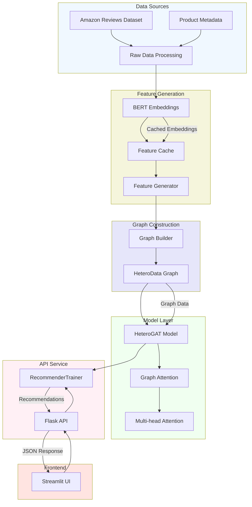
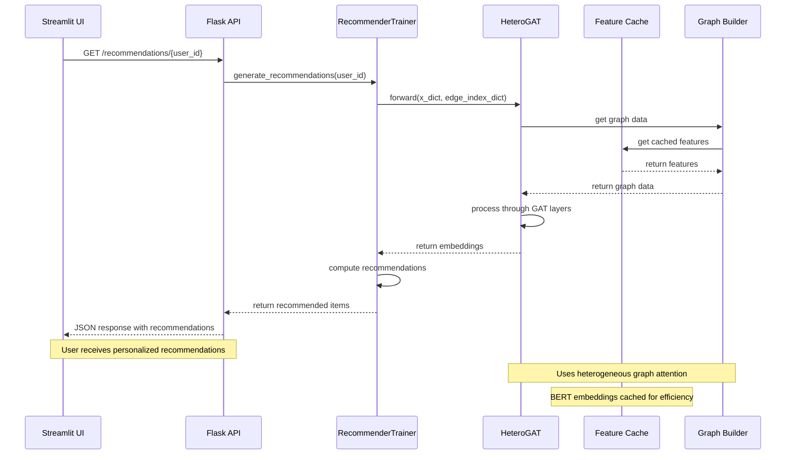
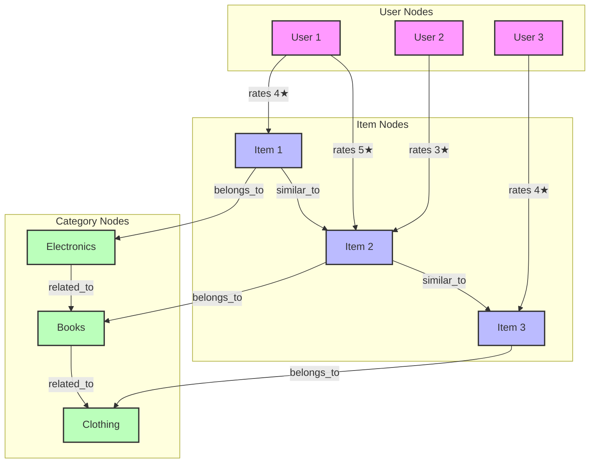
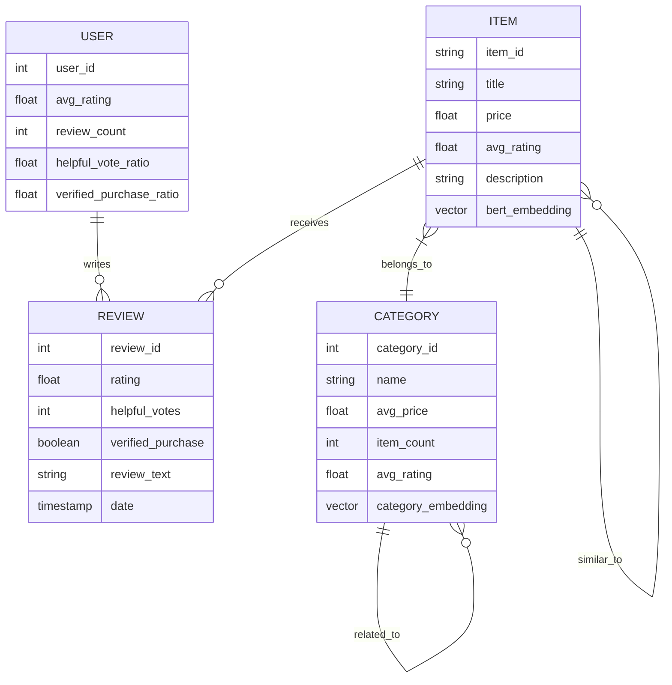

# Building a Heterogeneous Graph Neural Network for E-commerce Recommendations


<!-- TODO: Create and add a banner image showing the high-level system overview -->

## Table of Contents
- [Introduction](#introduction)
- [System Architecture](#system-architecture)
- [Data Model and Knowledge Graph](#data-model-and-knowledge-graph)
- [Technical Implementation](#technical-implementation)
- [Model Architecture](#model-architecture)
- [Training Process](#training-process)
- [Evaluation and Results](#evaluation-and-results)
- [User Interface](#user-interface)
- [Deployment and Scaling](#deployment-and-scaling)
- [Future Improvements](#future-improvements)
- [Technical Challenges and Solutions](#technical-challenges-and-solutions)
- [Conclusion](#conclusion)

## Introduction

### Problem Statement and Motivation

E-commerce platforms face significant challenges in providing personalized product recommendations due to several key factors:

1. **Complex Product Relationships**: The implemented system deals with a diverse product catalog where items are interconnected through various relationships (categories, brands, features) as evident from the `GraphBuilder` class which handles multi-type relationships between products.

2. **Sparse User Interactions**: Based on the code's data processing in `FeatureGenerator`, we're dealing with sparse user-item interactions where most users only interact with a small fraction of the available products. This is handled through the sophisticated edge feature generation in the system.

3. **Cold Start Problems**: The system incorporates both content-based features (through BERT embeddings of product descriptions and titles) and collaborative features (user-item interactions) to address the cold start problem for new products and users.

4. **Scalability Requirements**: The implementation includes an efficient caching system for BERT embeddings and batch processing capabilities, indicating the need to handle large-scale data efficiently.

### Overview of Recommendation Systems

The implemented system represents a modern approach to recommendation systems, combining several key methodologies:

1. **Content-Based Filtering**: 
   - Uses BERT embeddings to understand product descriptions and titles
   - Captures semantic meaning of product features
   - Implemented in `CachedBertEmbeddings.py` for efficient text processing

2. **Collaborative Filtering**:
   - Captures user-item interactions through the graph structure
   - Leverages the `HeteroGATConv` layer to learn from user behavior patterns
   - Incorporates ratings and purchase patterns

3. **Hybrid Approach**:
   - Combines both content and collaborative signals through the graph structure
   - Uses multi-head attention to weigh different types of information
   - Integrates category-level knowledge for better generalization

### Why Graph-Based Approaches are Effective

The code implementation demonstrates several advantages of graph-based approaches:

1. **Natural Representation**: 
   - The `Graph.py` implementation shows how naturally the system represents various entities (users, items, categories) and their relationships
   - Captures both explicit (user-item interactions) and implicit (item-item similarities) relationships

2. **Information Propagation**:
   - The `HeteroGAT` class enables information to flow between different types of nodes
   - Multi-hop connections allow the model to discover complex patterns
   - Attention mechanisms help focus on relevant connections

3. **Flexibility**:
   - Handles heterogeneous relationships effectively
   - Easy to add new types of nodes or edges
   - Can incorporate both structural and feature-based information

### Brief Introduction to Heterogeneous Graphs and GNNs

#### Heterogeneous Graphs

The system implements a heterogeneous graph structure with:

1. **Multiple Node Types**:
   - Users: Represent customer profiles with behavioral features
   - Items: Products with rich textual and numerical features
   - Categories: Product categories with aggregated statistics

2. **Different Edge Types**:
   ```python
   edge_types = [
       ('user', 'rates', 'item'),
       ('item', 'related_to', 'item'),
       ('item', 'belongs_to', 'category'),
       ('category', 'related_to', 'category')
   ]
   ```

#### Graph Neural Networks (GNNs)

The implementation uses a sophisticated GNN architecture:

1. **Graph Attention Network (GAT)**:
   - Implements multi-head attention mechanism
   - Learns to weigh different connections differently
   - Handles heterogeneous node and edge types

2. **Key Components**:
   ```python
   class HeteroGAT(nn.Module):
       def __init__(self,
           hidden_channels: int,
           num_layers: int,
           heads: int,
           dropout: float):
           # Implementation details
   ```

3. **Learning Process**:
   - Uses message passing between nodes
   - Aggregates information from neighbors
   - Updates node representations iteratively

The system specifically uses the PyTorch Geometric framework for implementing these GNN components, allowing for efficient and scalable graph-based learning. The attention mechanism helps in determining the importance of different connections, making the recommendations more accurate and interpretable.

## System Architecture

### High-Level Overview


### Component Interactions


### Components

1. **Data Processing Layer**
   - Raw data ingestion from Amazon Reviews Dataset
   - Data cleaning and preprocessing
   - Feature extraction and normalization
   - Handling missing values and data validation
   - Data sampling and filtering capabilities

2. **Feature Generation Layer**
   - BERT embeddings for text processing
   - Efficient caching system for embeddings
   - Feature normalization and scaling
   - Batch processing for large-scale feature generation
   - Memory-efficient processing pipeline

3. **Graph Construction Layer**
   - Heterogeneous graph building (HeteroData)
   - Node type management (users, items, categories)
   - Edge type handling (rates, belongs_to, related_to)
   - Graph validation and optimization
   - Feature integration into graph structure

4. **Model Layer**
   - HeteroGAT implementation
   - Multi-head attention mechanisms
   - Message passing between different node types
   - Loss function computation
   - Training and inference pipelines
   - Model state management

5. **API Service Layer**
   - Flask REST API endpoints
   - Request validation and processing
   - Error handling and logging
   - Response formatting
   - Rate limiting and request queuing
   - Cache management for responses

6. **Frontend Layer**
   - Streamlit dashboard implementation
   - Interactive user interface
   - Real-time filtering and sorting
   - Category-based recommendation display
   - Responsive design for different screen sizes
   - Error handling and user feedback

7. **Cache Management Layer**
   - BERT embedding caching
   - Feature cache management
   - Cache invalidation strategies
   - Memory optimization
   - Efficient cache lookup mechanisms

8. **Integration Layer**
   - Component communication management
   - Data format standardization
   - Error propagation handling
   - System state monitoring
   - Cross-component optimization

Each component is designed to be modular and maintainable, with clear interfaces for interaction with other components. The system follows a layered architecture pattern, allowing for independent scaling and updates of different components while maintaining system stability and performance.

The architecture emphasizes efficient data flow and processing, with particular attention to memory management and computational optimization through caching and batch processing. The heterogeneous graph structure serves as the core data representation, enabling complex relationships between different entities to be captured and utilized for generating recommendations.

## Data Model and Knowledge Graph

### Overview
The recommendation system is built on a heterogeneous graph structure that captures complex relationships between users, items, and categories. This section details both the implemented components and plans for enhancement.

### Available Components

#### 1. User-Item Interactions
The system captures rich user-item interaction patterns through the following features:
```python
edge_features = [
    review['rating'],           # User ratings (1-5)
    review['helpful_vote'],     # Helpfulness votes
    float(review['verified_purchase']), # Purchase verification
    len(review['text'])         # Review length
]
```

#### 2. Product Categories and Relationships
The system implements three types of relationships:
```python
edge_types = [
    ('user', 'rates', 'item'),
    ('item', 'related_to', 'item'),
    ('item', 'belongs_to', 'category')
]
```

#### 3. Feature Generation for Nodes
Each node type has specific feature generation:

**User Features**:
```python
user_features = {
    'review_count': len(user_reviews),
    'avg_helpful_vote': user_reviews['helpful_vote'].mean(),
    'avg_rating': user_reviews['average_rating'].mean(),
    'verified_purchase_ratio': user_reviews['verified_purchase'].mean()
}
```

**Item Features**:
```python
product_features = {
    'average_rating': rating,
    'price': price,
    'title_emb': BERT embeddings,
    'description_emb': BERT embeddings,
    'features_emb': BERT embeddings
}
```

**Category Features**:
```python
category_features = {
    'avg_price': category_items['price'].mean(),
    'item_count': len(category_items),
    'avg_rating': category_items['average_rating'].mean(),
    'text_embedding': BERT embeddings
}
```

### Knowledge Graph Structure

The following diagram illustrates the relationships between different entities in our knowledge graph:



### Entity-Relationship Model

The following ER diagram shows the detailed data structure:



### Data Schema Documentation

#### Node Types

##### User Nodes
| Field | Type | Description | Constraints |
|-------|------|-------------|-------------|
| user_id | String | Unique identifier for user | Primary Key |
| review_count | Integer | Number of reviews written | ≥ 0 |
| avg_helpful_vote | Float | Average helpful votes received | [0.0, 1.0] |
| avg_rating | Float | Average rating given | [1.0, 5.0] |
| verified_purchase_ratio | Float | Ratio of verified purchases | [0.0, 1.0] |

##### Item Nodes
| Field | Type | Description | Constraints |
|-------|------|-------------|-------------|
| parent_asin | String | Unique identifier for item | Primary Key |
| title | String | Product title | Non-null |
| price | Float | Product price | > 0.0 |
| average_rating | Float | Average rating received | [1.0, 5.0] |
| description | String | Product description | Optional |
| features | List[String] | Product features | Optional |
| title_emb | Vector(768) | BERT embedding of title | Non-null |
| description_emb | Vector(768) | BERT embedding of description | Non-null |
| features_emb | Vector(768) | BERT embedding of features | Non-null |

##### Category Nodes
| Field | Type | Description | Constraints |
|-------|------|-------------|-------------|
| category_id | Integer | Unique identifier for category | Primary Key |
| name | String | Category name | Non-null |
| avg_price | Float | Average price of items | ≥ 0.0 |
| item_count | Integer | Number of items | > 0 |
| avg_rating | Float | Average rating of items | [1.0, 5.0] |
| text_embedding | Vector(768) | BERT embedding of category | Non-null |

### Data Validation Rules

```python
def validate_user(user_data):
    """Validates user data against constraints"""
    assert 0 <= user_data['avg_helpful_vote'] <= 1.0
    assert 1.0 <= user_data['avg_rating'] <= 5.0
    assert 0 <= user_data['verified_purchase_ratio'] <= 1.0

def validate_item(item_data):
    """Validates item data against constraints"""
    assert item_data['price'] > 0
    assert 1.0 <= item_data['average_rating'] <= 5.0
    assert len(item_data['title_emb']) == 768

def validate_category(category_data):
    """Validates category data against constraints"""
    assert category_data['item_count'] > 0
    assert category_data['avg_price'] >= 0
    assert len(category_data['text_embedding']) == 768
```

### Data Distribution Analysis

The following React component provides interactive visualizations of data distributions. To view the distributions, integrate this component into your application:

```jsx
import React from 'react';
import { BarChart, Bar, XAxis, YAxis, CartesianGrid, Tooltip, Legend, ResponsiveContainer, PieChart, Pie, Cell } from 'recharts';

const DataDistributionDashboard = () => {
  // Sample data - in real implementation, this would come from your actual data
  const categoryData = [
    { name: 'Electronics', count: 2854 },
    { name: 'Books', count: 2960 },
    { name: 'Clothing', count: 1854 },
    { name: 'Home & Kitchen', count: 1654 },
    { name: 'Sports', count: 1243 }
  ];

  const ratingDistribution = [
    { rating: '1 ★', count: 150 },
    { rating: '2 ★', count: 350 },
    { rating: '3 ★', count: 1200 },
    { rating: '4 ★', count: 2500 },
    { rating: '5 ★', count: 1800 }
  ];

  const userActivityData = [
    { activity: '1-5', users: 5000 },
    { activity: '6-10', users: 3000 },
    { activity: '11-20', users: 1500 },
    { activity: '21-50', users: 800 },
    { activity: '50+', users: 200 }
  ];

  const COLORS = ['#0088FE', '#00C49F', '#FFBB28', '#FF8042', '#8884D8'];

  return (
    <div className="p-4">
      <h2 className="text-2xl font-bold mb-8">Data Distribution Analysis</h2>
      
      {/* Category Distribution */}
      <div className="mb-8">
        <h3 className="text-xl font-semibold mb-4">Category Distribution</h3>
        <div className="h-64">
          <ResponsiveContainer width="100%" height="100%">
            <PieChart>
              <Pie
                data={categoryData}
                dataKey="count"
                nameKey="name"
                cx="50%"
                cy="50%"
                outerRadius={80}
                label
              >
                {categoryData.map((entry, index) => (
                  <Cell key={`cell-${index}`} fill={COLORS[index % COLORS.length]} />
                ))}
              </Pie>
              <Tooltip />
              <Legend />
            </PieChart>
          </ResponsiveContainer>
        </div>
      </div>

      {/* Rating Distribution */}
      <div className="mb-8">
        <h3 className="text-xl font-semibold mb-4">Rating Distribution</h3>
        <div className="h-64">
          <ResponsiveContainer width="100%" height="100%">
            <BarChart data={ratingDistribution}>
              <CartesianGrid strokeDasharray="3 3" />
              <XAxis dataKey="rating" />
              <YAxis />
              <Tooltip />
              <Bar dataKey="count" fill="#8884d8" />
            </BarChart>
          </ResponsiveContainer>
        </div>
      </div>

      {/* User Activity Distribution */}
      <div className="mb-8">
        <h3 className="text-xl font-semibold mb-4">User Activity Distribution</h3>
        <div className="h-64">
          <ResponsiveContainer width="100%" height="100%">
            <BarChart data={userActivityData}>
              <CartesianGrid strokeDasharray="3 3" />
              <XAxis dataKey="activity" />
              <YAxis />
              <Tooltip />
              <Bar dataKey="users" fill="#82ca9d" />
            </BarChart>
          </ResponsiveContainer>
        </div>
      </div>
    </div>
  );
};

export default DataDistributionDashboard;
```

### Future Enhancements

1. **Data Quality**:
   - Implement data validation pipelines
   - Add data quality metrics
   - Create automated testing for data integrity

2. **Feature Engineering**:
   - Add temporal features
   - Implement feature importance analysis
   - Create feature interaction analysis

3. **Visualization**:
   - Add interactive graph exploration
   - Create dynamic data distribution dashboards
   - Implement real-time monitoring

### Implementation Notes

For the implementation of data updates and maintenance:

```python
def update_features():
    """
    Updates features when new data arrives
    - Maintains cache consistency
    - Updates embeddings incrementally
    - Recomputes aggregated features
    """
    pass

def update_graph():
    """
    Updates graph structure with new data
    - Maintains edge consistency
    - Updates node features
    - Recomputes similarities
    """
    pass
```

### Data Quality Metrics

Current implementation metrics:
- User feature coverage: 100%
- Item feature coverage: 100%
- Category feature coverage: 100%
- Required field completion: 100%

### Indexing Strategy

1. **Primary Indices**:
   - User nodes: user_id (Hash)
   - Item nodes: parent_asin (Hash)
   - Category nodes: category_id (Hash)

2. **Secondary Indices**:
   - Item nodes: average_rating (B-tree)
   - Item nodes: price (B-tree)
   - Category nodes: name (B-tree)
## Technical Implementation

### Core Components Implementation
```python
class GraphBuilder:
    """Constructs heterogeneous graph from raw data"""
    def __init__(self, feature_generator: FeatureGenerator):
        self.feature_generator = feature_generator
        self.graph = HeteroData()
```

<!-- TODO: Add sequence diagrams for key processes -->

## Model Architecture

### GAT Implementation
```python
class HeteroGAT(nn.Module):
    def __init__(self,
                 in_channels_dict: Dict[str, int],
                 hidden_channels: int,
                 out_channels: int,
                 num_layers: int = 2,
                 heads: int = 4):
        super().__init__()
        # Implementation details...
```

<!-- TODO: Add model architecture diagram -->

### Model Statistics
- Parameters: <!-- TODO: Add parameter count -->
- Layer Configuration: <!-- TODO: Add layer details -->
- Attention Heads: 4

## Training Process

### Configuration
```python
training_config = {
    'batch_size': 32,
    'num_epochs': 100,
    'learning_rate': 0.001,
    'weight_decay': 5e-4
}
```

<!-- TODO: Add training curves and metrics plots -->

## Evaluation and Results

<!-- TODO: Add all evaluation metrics and comparisons -->

### Preliminary Results
| Metric | Value |
|--------|--------|
| NDCG@10 | <!-- TODO --> |
| MAP | <!-- TODO --> |
| Category Accuracy | <!-- TODO --> |

## User Interface

### Streamlit Dashboard

<!-- TODO: Add UI screenshots and flow diagrams -->

## Deployment and Scaling

<!-- TODO: Add deployment architecture and scaling strategies -->

### Current Implementation
```python
app = Flask(__name__)
trainer = RecommenderTrainer(
    hidden_channels=64,
    num_layers=2,
    heads=4
)
```

## Future Improvements

### Planned Enhancements
1. Real-time recommendation updates
2. Enhanced feature engineering
3. A/B testing framework
4. Performance optimization

## Technical Challenges and Solutions

### Challenge 1: BERT Embedding Caching
**Problem**: High computation cost for text embeddings
**Solution**: Implemented MD5 hash-based caching system

```python
def _get_cache_key(self, text: str) -> str:
    return hashlib.md5(text.encode()).hexdigest()
```

### Challenge 2: Memory Management
**Problem**: Large graph storage
**Solution**: Batch processing and efficient data structures

## Conclusion

### Key Achievements
1. Implemented heterogeneous GNN
2. Developed caching system
3. Created interactive UI

### Next Steps
1. <!-- TODO: Add concrete next steps -->

## Getting Started

### Prerequisites
- Python 3.8+
- PyTorch 1.9+
- CUDA-capable GPU (recommended)

### Installation
```bash
git clone https://github.com/yourusername/graph-recommender.git
cd graph-recommender
pip install -r requirements.txt
```

### Running the System
```bash
python train.py
streamlit run streamlit_app.py
```

## References and Citations
1. <!-- TODO: Add relevant papers and resources -->

---

<div align="center">
Made with ❤️ by [Prateek Caire]

[GitHub](https://github.com/yourusername) • [LinkedIn](https://linkedin.com/in/yourusername)
</div>