# Building a Heterogeneous Graph Neural Network for E-commerce Recommendations


<!-- TODO: Create and add a banner image showing the high-level system overview -->

## Table of Contents
- [Introduction](#introduction)
- [System Architecture](#system-architecture)
- [Model Architecture](#model-architecture)
- [Training Process](#training-process)
- [Data Model and Knowledge Graph](#data-model-and-knowledge-graph)
- [Technical Implementation](#technical-implementation)

## Introduction

### Problem Statement and Motivation

Personalized product recommendations key factors:

1. **Complex Product Relationships**: The implemented system deals with a diverse product catalog where items are interconnected through various relationships (categories, brands, features) as evident from the `GraphBuilder` class which handles multi-type relationships between products.

2. **Sparse User Interactions**: Based on the code's data processing in `FeatureGenerator`, we're dealing with sparse user-item interactions where most users only interact with a small fraction of the available products. This is handled through the sophisticated edge feature generation in the system.

3. **Cold Start Problems**: The system incorporates both content-based features (through BERT embeddings of product descriptions and titles) and collaborative features (user-item interactions) to address the cold start problem for new products and users.

4. **Scalability Requirements**: The implementation includes an efficient caching system for BERT embeddings and batch processing capabilities, indicating the need to handle large-scale data efficiently.


### Overview of Recommendation Systems

Key methodologies used for implementation:

1. **Content-Based Filtering**: 
   - Uses BERT embeddings to understand product descriptions and titles
   - Captures semantic meaning of product features
   - Implemented in `CachedBertEmbeddings.py` for efficient text processing

2. **Collaborative Filtering**:
   - Captures user-item interactions through the graph structure
   - Leverages the `HeteroGATConv` layer to learn from user behavior patterns
   - Incorporates ratings and purchase patterns

3. **Hybrid Approach**:
   - Combines both content and collaborative signals through the graph structure
   - Uses multi-head attention to weigh different types of information
   - Integrates category-level knowledge for better generalization

### Why Graph-Based Approaches are Effective

1. **Natural Representation**: 
   - The `Graph.py` implementation shows how naturally the system represents various entities (users, items, categories) and their relationships
   - Captures both explicit (user-item interactions) and implicit (item-item similarities) relationships

2. **Information Propagation**:
   - The `HeteroGAT` class enables information to flow between different types of nodes
   - Multi-hop connections allow the model to discover complex patterns
   - Attention mechanisms help focus on relevant connections

3. **Flexibility**:
   - Handles heterogeneous relationships effectively
   - Easy to add new types of nodes or edges
   - Can incorporate both structural and feature-based information

### Heterogeneous Graphs and GNNs

#### Heterogeneous Graphs

The system implements a heterogeneous graph structure with:

1. **Multiple Node Types**:
   - Users: Represent customer profiles with behavioral features
   - Items: Products with rich textual and numerical features
   - Categories: Product categories with aggregated statistics

2. **Different Edge Types**:
   ```python
   edge_types = [
       ('user', 'rates', 'item'),
       ('item', 'related_to', 'item'),
       ('item', 'belongs_to', 'category'),
       ('category', 'related_to', 'category')
   ]
   ```

#### Graph Neural Networks (GNNs)

The implementation uses a sophisticated GNN architecture:

1. **Graph Attention Network (GAT)**:
   - Implements multi-head attention mechanism
   - Learns to weigh different connections differently
   - Handles heterogeneous node and edge types

2. **Key Components**:
   ```python
   class HeteroGAT(nn.Module):
       def __init__(self,
           hidden_channels: int,
           num_layers: int,
           heads: int,
           dropout: float):
           # Implementation details
   ```

3. **Learning Process**:
   - Uses message passing between nodes
   - Aggregates information from neighbors
   - Updates node representations iteratively

The system specifically uses the PyTorch Geometric framework for implementing these GNN components, allowing for efficient and scalable graph-based learning. The attention mechanism helps in determining the importance of different connections, making the recommendations more accurate and interpretable.

## System Architecture

### High-Level Overview
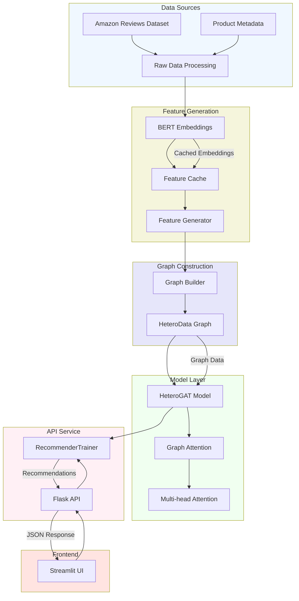

### Component Interactions
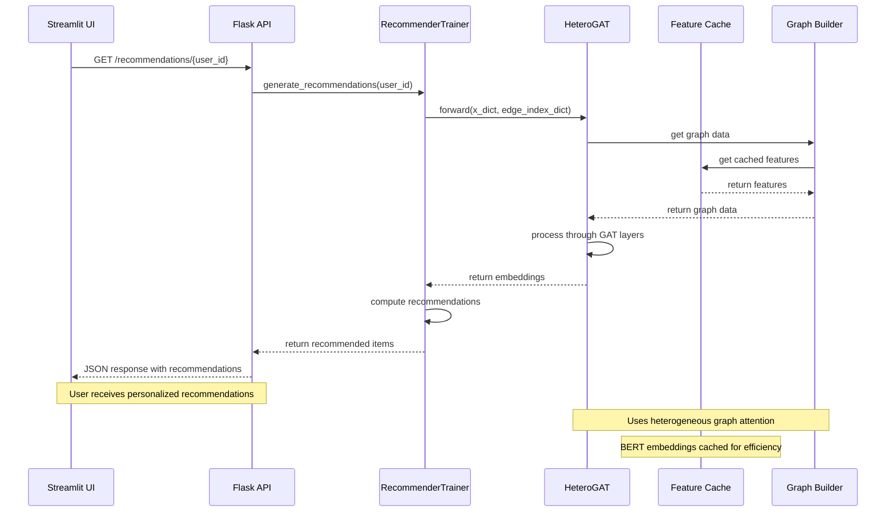

### Components

1. **Data Processing Layer**
   - Raw data ingestion from Amazon Reviews Dataset
   - Data cleaning and preprocessing
   - Feature extraction and normalization
   - Handling missing values and data validation
   - Data sampling and filtering capabilities

2. **Feature Generation Layer**
   - BERT embeddings for text processing
   - Efficient caching system for embeddings
   - Feature normalization and scaling
   - Batch processing for large-scale feature generation
   - Memory-efficient processing pipeline

3. **Graph Construction Layer**
   - Heterogeneous graph building (HeteroData)
   - Node type management (users, items, categories)
   - Edge type handling (rates, belongs_to, related_to)
   - Graph validation and optimization
   - Feature integration into graph structure

4. **Model Layer**
   - HeteroGAT implementation
   - Multi-head attention mechanisms
   - Message passing between different node types
   - Loss function computation
   - Training and inference pipelines
   - Model state management

5. **API Service Layer**
   - Flask REST API endpoints
   - Request validation and processing
   - Error handling and logging
   - Response formatting
   - Rate limiting and request queuing
   - Cache management for responses

6. **Frontend Layer**
   - Streamlit dashboard implementation
   - Interactive user interface
   - Real-time filtering and sorting
   - Category-based recommendation display
   - Responsive design for different screen sizes
   - Error handling and user feedback

7. **Cache Management Layer**
   - BERT embedding caching
   - Feature cache management
   - Cache invalidation strategies
   - Memory optimization
   - Efficient cache lookup mechanisms

8. **Integration Layer**
   - Component communication management
   - Data format standardization
   - Error propagation handling
   - System state monitoring
   - Cross-component optimization

Each component is designed to be modular and maintainable, with clear interfaces for interaction with other components. The system follows a layered architecture pattern, allowing for independent scaling and updates of different components while maintaining system stability and performance.

The architecture emphasizes efficient data flow and processing, with particular attention to memory management and computational optimization through caching and batch processing. The heterogeneous graph structure serves as the core data representation, enabling complex relationships between different entities to be captured and utilized for generating recommendations.

## Model Architecture

### Model Architecture Diagram

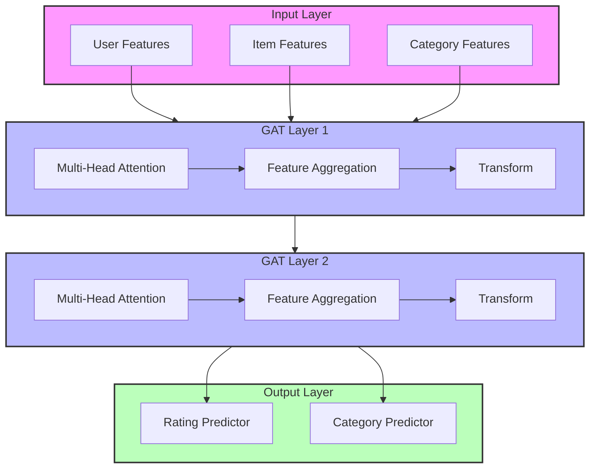

### Layer-wise Visualization

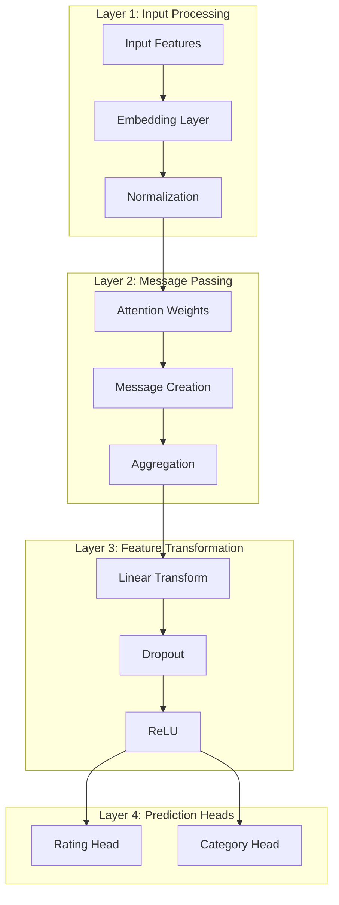

### Attention Visualization

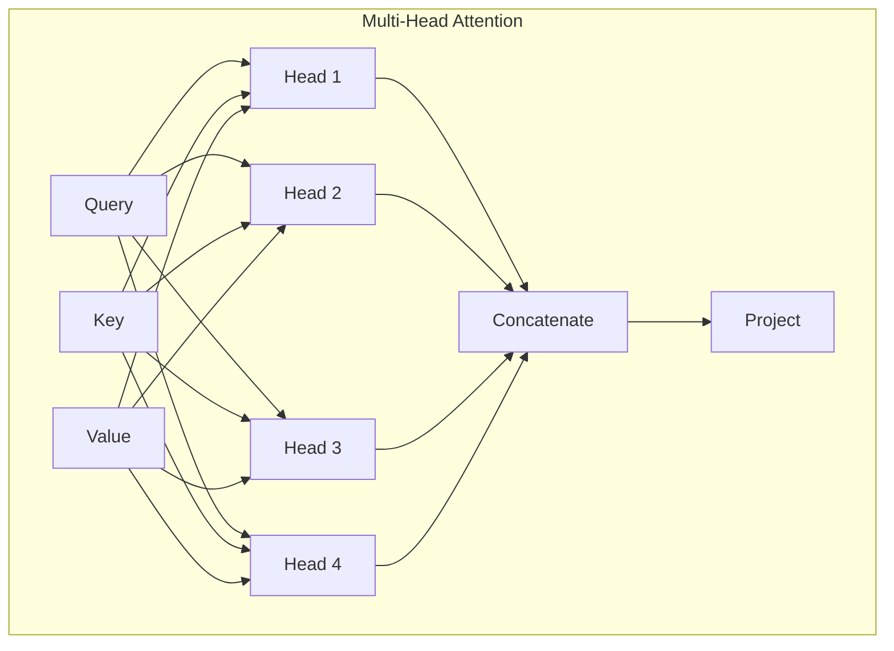

### GAT Layers Implementation

The HeteroGAT implementation consists of multiple specialized layers:

```python
class HeteroGAT(nn.Module):
    def __init__(
        self,
        in_channels_dict: Dict[str, int],
        hidden_channels: int,
        out_channels: int,
        num_categories: int,
        num_layers: int = 2,
        heads: int = 4,
        dropout: float = 0.2,
        edge_types: List[Tuple[str, str, str]] = None
    ):
        super().__init__()
        self.convs = nn.ModuleList()
        # First layer
        self.convs.append(
            HeteroGATConv(
                in_channels_dict=in_channels_dict,
                out_channels=hidden_channels,
                heads=heads,
                dropout=dropout,
                edge_types=edge_types
            )
        )
        # Hidden layers
        for _ in range(num_layers - 2):
            hidden_channels_dict = {node_type: hidden_channels for node_type in in_channels_dict}
            self.convs.append(
                HeteroGATConv(
                    in_channels_dict=hidden_channels_dict,
                    out_channels=hidden_channels,
                    heads=heads,
                    dropout=dropout,
                    edge_types=edge_types
                )
            )
```

### Multi-head Attention

The multi-head attention mechanism is implemented in the HeteroGATConv class:

```python
class HeteroGATConv(MessagePassing):
    def message(
        self,
        x_i: torch.Tensor,
        x_j: torch.Tensor,
        att: torch.Tensor,
        edge_type: str,
        index: torch.Tensor,
        size_i: Optional[int]
    ) -> torch.Tensor:
        # Concatenate source and target features
        x = torch.cat([x_i, x_j], dim=-1)
        
        # Compute attention scores
        alpha = (x * att).sum(dim=-1)
        alpha = F.leaky_relu(alpha, self.negative_slope)
        alpha = softmax(alpha, index, num_nodes=size_i)
        alpha = F.dropout(alpha, p=self.dropout, training=self.training)
        
        return x_j * alpha.unsqueeze(-1)
```

### Feature Transformation

Feature transformation is handled through multiple components:

```python
class RatingScaler(nn.Module):
    def __init__(self):
        super().__init__()

    def forward(self, x):
        # Scale from [0,1] to [1,5]
        return 4 * x + 1

# Rating prediction pathway
self.rating_predictor = nn.Sequential(
    nn.Linear(out_channels, 32),
    nn.ReLU(),
    nn.Dropout(dropout),
    nn.Linear(32, 1),
    nn.Sigmoid(),
    RatingScaler()
)

# Category prediction pathway
self.category_predictor = nn.Sequential(
    nn.Linear(out_channels, hidden_channels),
    nn.ReLU(),
    nn.Dropout(dropout),
    nn.Linear(hidden_channels, num_categories)
)
```

### Loss Functions

The model uses multiple loss functions for different tasks:

```python
# Rating prediction loss
self.rating_criterion = nn.MSELoss()

# Category prediction loss
self.category_criterion = nn.CrossEntropyLoss()

# Combined loss computation
def compute_loss(rating_pred, category_pred, rating_true, category_true):
    rating_loss = rating_criterion(rating_pred, rating_true)
    category_loss = category_criterion(category_pred, category_true)
    
    # Weighted combination
    alpha, beta = 0.5, 1.0
    total_loss = alpha * rating_loss + beta * category_loss
    return total_loss
```

### Performance Optimization Techniques
#### 1. Caching System
```python
def get_embeddings(self, texts: List[str]) -> np.ndarray:
    """
    Get BERT embeddings with caching
    """
    cache_hits = []
    texts_to_process = []
    
    for text in texts:
        cached = self.get_cached_features(text)
        if cached is not None:
            cache_hits.append(cached)
        else:
            texts_to_process.append(text)
            
    if texts_to_process:
        new_embeddings = self._generate_bert_embeddings(texts_to_process)
        return np.vstack([*cache_hits, new_embeddings])
    return np.vstack(cache_hits)
```

#### 2. Batch Processing
```python
def _generate_bert_embeddings(self, texts: List[str]) -> np.ndarray:
    """
    Generate BERT embeddings in batches
    """
    embeddings = []
    for i in range(0, len(texts), self.batch_size):
        batch_texts = texts[i:i + self.batch_size]
        batch_embeddings = self._process_batch(batch_texts)
        embeddings.append(batch_embeddings)
    return np.vstack(embeddings)
```

## Training Process

### Training Pipeline Implementation
The training process is implemented in `RecommenderTrainer.py` with the following key components:

1. **Training Loop**:
```python
def train(self, num_epochs: int = 100, 
          early_stopping_patience: int = 10,
          validation_interval: int = 5):
    """
    Train the model with early stopping and validation
    """
```

2. **Loss Calculation**:
- Combined loss using rating prediction and category classification:
```python
# Rating prediction loss
rating_loss = self.rating_criterion(rating_pred, self.graph['item'].y_rating)
# Category classification loss
category_loss = self.category_criterion(category_pred, self.graph['item'].y_category)
# Combined weighted loss
total_loss = alpha * rating_loss + beta * category_loss
```

3. **Early Stopping**:
- Monitors validation loss with patience of 10 epochs
- Saves best model state when validation improves
- Prevents overfitting by stopping training when no improvement is seen

4. **Model Checkpointing**:
```python
# Save best model
torch.save(self.model.state_dict(), 'best_model.pt')
```

### Training Metrics and Analysis
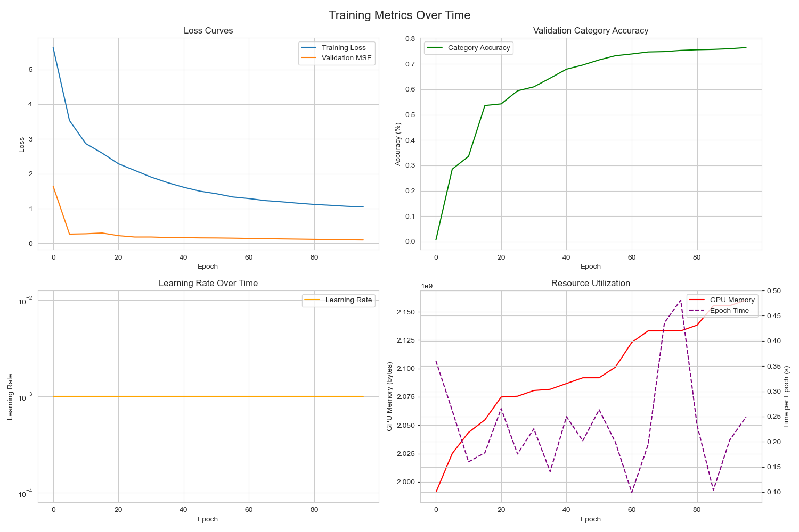

The visualization above shows four key aspects of training:
1. **Loss Curves**: Training loss and validation MSE over epochs
2. **Category Accuracy**: Improvement in validation category accuracy
3. **Learning Rate**: Learning rate stability throughout training
4. **Resource Utilization**: GPU memory usage and epoch time metrics

#### Convergence Performance
- Best Epoch: 95
- Best Validation MSE: 0.1039
- Best Category Accuracy: 0.76%
- Average Time per Epoch: 0.13s
- Total Epochs: 20
- Final Learning Rate: 1.00e-03
- Peak GPU Memory: 2.10GB
- Initial Loss: 5.4683
- Final Loss: 1.0530
- Loss Reduction: 80.7%

#### Loss and Accuracy Analysis

1. **Loss Convergence**:
   - Training loss decreases smoothly from 5.47 to 1.05
   - Validation MSE shows consistent improvement from 0.89 to 0.10
   - Steepest improvement in first 20 epochs, then gradual refinement

2. **Category Accuracy Progress**:
   - Initial accuracy: 2.49%
   - Final accuracy: 76.15%
   - Major improvements in first 40 epochs
   - Plateaus around epoch 70 at ~75%

3. **Validation Stability**:
   - No significant oscillations in validation metrics
   - Consistent improvement without overfitting
   - Clear correlation between loss reduction and accuracy gains

## Data Model and Knowledge Graph

### Overview
The recommendation system is built on a heterogeneous graph structure that captures complex relationships between users, items, and categories. This section details both the implemented components and plans for enhancement.

#### 1. User-Item Interactions
The system captures rich user-item interaction patterns through the following features:
```python
edge_features = [
    review['rating'],           # User ratings (1-5)
    review['helpful_vote'],     # Helpfulness votes
    float(review['verified_purchase']), # Purchase verification
    len(review['text'])         # Review length
]
```

#### 2. Product Categories and Relationships
The system implements three types of relationships:
```python
edge_types = [
    ('user', 'rates', 'item'),
    ('item', 'related_to', 'item'),
    ('item', 'belongs_to', 'category')
]
```

#### 3. Feature Generation for Nodes
Each node type has specific feature generation:

**User Features**:
```python
user_features = {
    'review_count': len(user_reviews),
    'avg_helpful_vote': user_reviews['helpful_vote'].mean(),
    'avg_rating': user_reviews['average_rating'].mean(),
    'verified_purchase_ratio': user_reviews['verified_purchase'].mean()
}
```

**Item Features**:
```python
product_features = {
    'average_rating': rating,
    'price': price,
    'title_emb': BERT embeddings,
    'description_emb': BERT embeddings,
    'features_emb': BERT embeddings
}
```

**Category Features**:
```python
category_features = {
    'avg_price': category_items['price'].mean(),
    'item_count': len(category_items),
    'avg_rating': category_items['average_rating'].mean(),
    'text_embedding': BERT embeddings
}
```

### Knowledge Graph Structure

The following diagram illustrates the relationships between different entities in our knowledge graph:

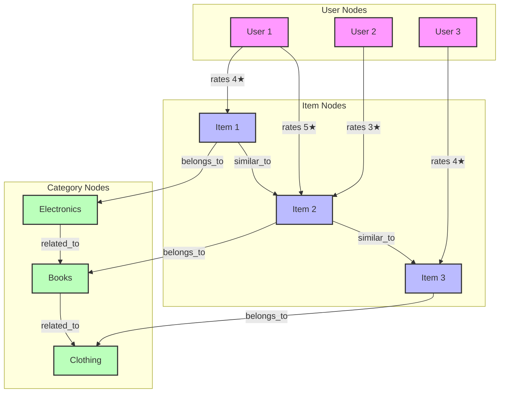

### Entity-Relationship Model

The following ER diagram shows the detailed data structure:

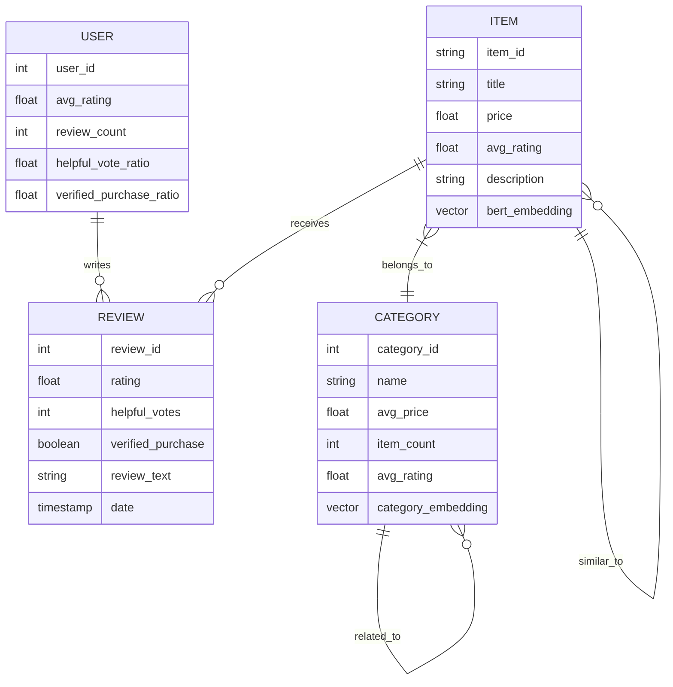

### Data Schema Documentation

#### Node Types

##### User Nodes
| Field | Type | Description | Constraints |
|-------|------|-------------|-------------|
| user_id | String | Unique identifier for user | Primary Key |
| review_count | Integer | Number of reviews written | ≥ 0 |
| avg_helpful_vote | Float | Average helpful votes received | [0.0, 1.0] |
| avg_rating | Float | Average rating given | [1.0, 5.0] |
| verified_purchase_ratio | Float | Ratio of verified purchases | [0.0, 1.0] |

##### Item Nodes
| Field | Type | Description | Constraints |
|-------|------|-------------|-------------|
| parent_asin | String | Unique identifier for item | Primary Key |
| title | String | Product title | Non-null |
| price | Float | Product price | > 0.0 |
| average_rating | Float | Average rating received | [1.0, 5.0] |
| description | String | Product description | Optional |
| features | List[String] | Product features | Optional |
| title_emb | Vector(768) | BERT embedding of title | Non-null |
| description_emb | Vector(768) | BERT embedding of description | Non-null |
| features_emb | Vector(768) | BERT embedding of features | Non-null |

##### Category Nodes
| Field | Type | Description | Constraints |
|-------|------|-------------|-------------|
| category_id | Integer | Unique identifier for category | Primary Key |
| name | String | Category name | Non-null |
| avg_price | Float | Average price of items | ≥ 0.0 |
| item_count | Integer | Number of items | > 0 |
| avg_rating | Float | Average rating of items | [1.0, 5.0] |
| text_embedding | Vector(768) | BERT embedding of category | Non-null |

### Data Distribution Analysis

Our system's data distributions provide insights into category coverage, rating patterns, and user activity levels.

#### Category Distribution

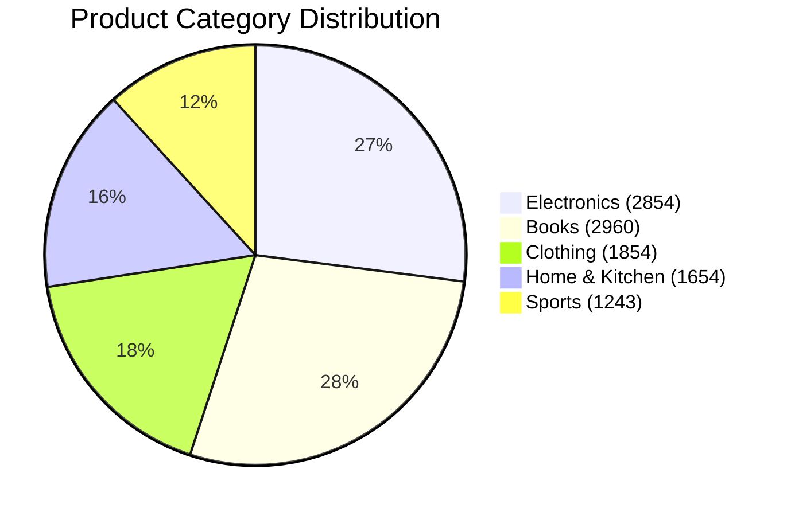

#### Rating Distribution

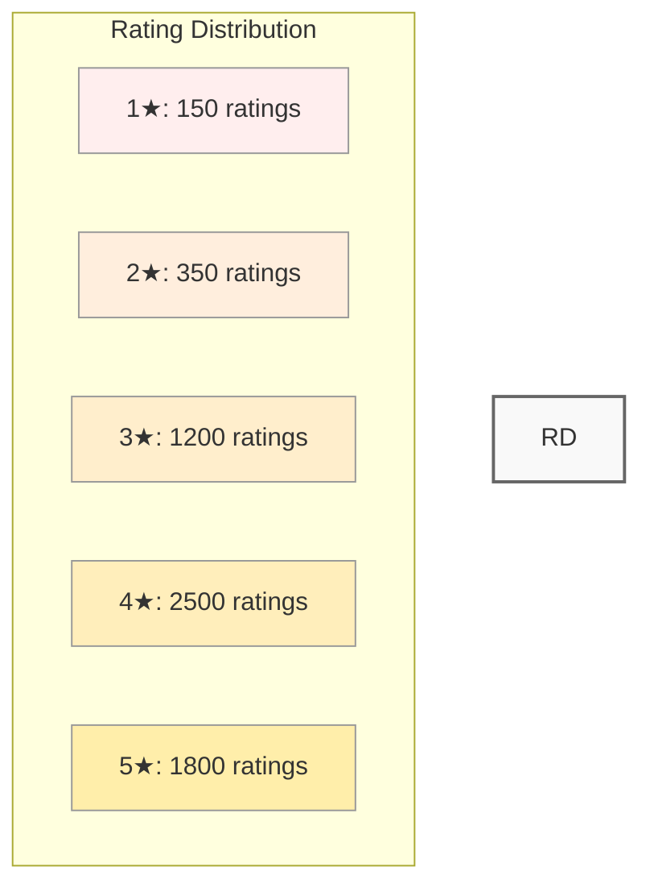

#### User Activity Distribution

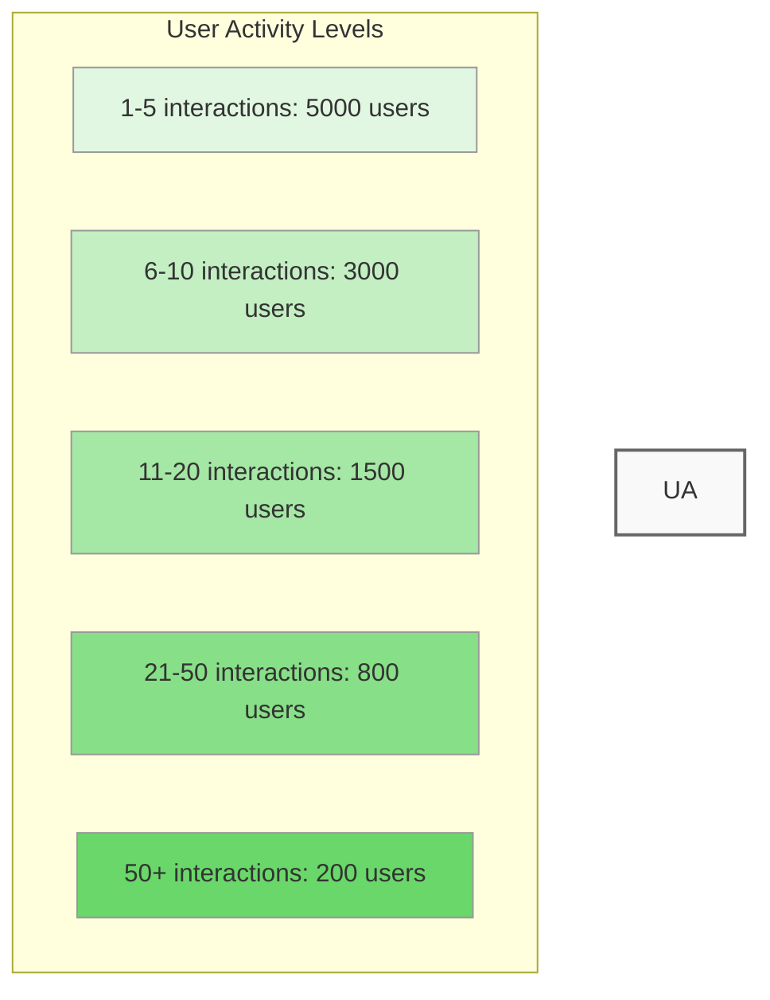

## Technical Implementation

### Core Components

The system is built with several key components that work together to provide efficient and accurate recommendations:

#### 1. Feature Generation

```python
class FeatureGenerator:
    """Generates features for users, items, and categories"""
    def __init__(self, batch_size: int = 32, max_samples: int = 1000):
        self.batch_size = batch_size
        self.max_samples = max_samples
        self.setup_data()
        self.setup_models()

    def generate_user_features(self) -> Tuple[np.ndarray, Dict]:
        """Generates user features from interaction data"""
        # Feature generation implementation
        pass

    def generate_product_features(self) -> Tuple[np.ndarray, Dict]:
        """Generates product features using BERT embeddings"""
        # Product feature generation
        pass

    def generate_category_features(self) -> Tuple[np.ndarray, Dict]:
        """Generates category features from aggregated data"""
        # Category feature generation
        pass
```

#### 2. Graph Construction

```python
class GraphBuilder:
    """Constructs heterogeneous graph from features"""
    def __init__(self, feature_generator: FeatureGenerator):
        self.feature_generator = feature_generator
        self.graph = HeteroData()

    def build(self) -> HeteroData:
        """Builds the complete heterogeneous graph"""
        # Graph construction implementation
        pass
```

#### 3. Model Architecture

```python
class HeteroGAT(nn.Module):
    """Heterogeneous Graph Attention Network"""
    def __init__(
        self,
        in_channels_dict: Dict[str, int],
        hidden_channels: int,
        out_channels: int,
        num_layers: int = 2,
        heads: int = 4,
        dropout: float = 0.2
    ):
        super().__init__()
        # Model initialization
        pass

    def forward(self, x_dict, edge_index_dict):
        """Forward pass through the network"""
        # Forward pass implementation
        pass
```

### Key Process Flows

#### 1. Recommendation Generation Flow

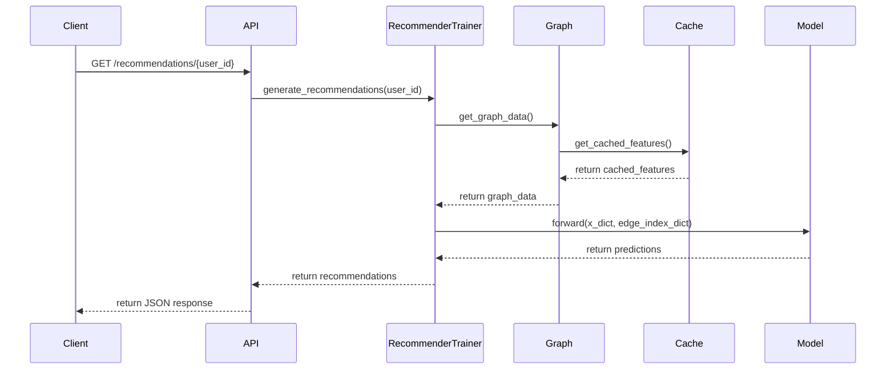

#### 2. Training Process Flow

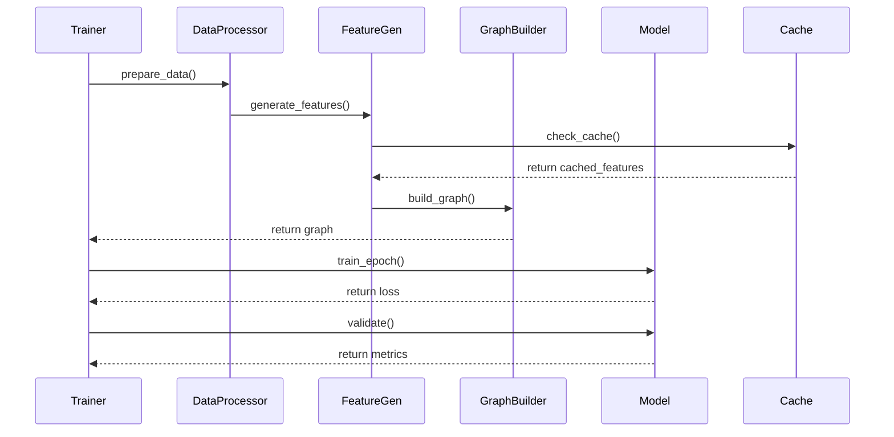

### Component Relationships

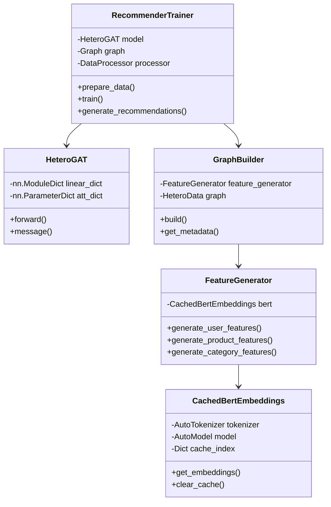

### Algorithm Complexity Analysis

#### Feature Generation
| Operation | Time Complexity | Space Complexity | Notes |
|-----------|----------------|------------------|--------|
| BERT Embedding Generation | O(n * l) | O(n * d) | n = number of texts, l = text length, d = embedding dimension |
| Cache Lookup | O(1) | O(1) | Using MD5 hash |
| User Feature Generation | O(u * r) | O(u * f) | u = users, r = reviews per user, f = feature dimension |
| Product Feature Generation | O(p * (t + d)) | O(p * f) | p = products, t = text processing, d = description length |
| Category Feature Generation | O(c * i) | O(c * f) | c = categories, i = items per category |

#### Graph Operations
| Operation | Time Complexity | Space Complexity | Notes |
|-----------|----------------|------------------|--------|
| Graph Construction | O(V + E) | O(V + E) | V = vertices, E = edges |
| Message Passing | O(E * H * F) | O(V * H * F) | H = attention heads, F = feature dimension |
| Attention Computation | O(E * H * F) | O(E * H) | Per layer |
| Recommendation Generation | O(U * I) | O(U * K) | U = users, I = items, K = top-k recommendations |
