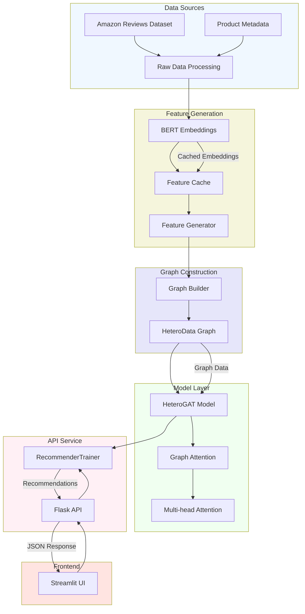
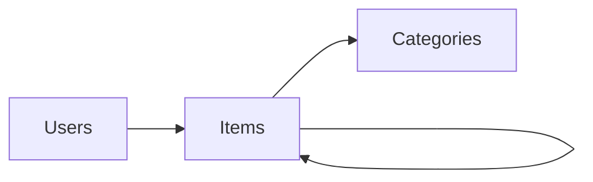

# Building a Heterogeneous Graph Neural Network for E-commerce Recommendations


<!-- TODO: Create and add a banner image showing the high-level system overview -->

## Table of Contents
- [Introduction](#introduction)
- [System Architecture](#system-architecture)
- [Data Model and Knowledge Graph](#data-model-and-knowledge-graph)
- [Technical Implementation](#technical-implementation)
- [Model Architecture](#model-architecture)
- [Training Process](#training-process)
- [Evaluation and Results](#evaluation-and-results)
- [User Interface](#user-interface)
- [Deployment and Scaling](#deployment-and-scaling)
- [Future Improvements](#future-improvements)
- [Technical Challenges and Solutions](#technical-challenges-and-solutions)
- [Conclusion](#conclusion)

# Introduction

## Problem Statement and Motivation

E-commerce platforms face significant challenges in providing personalized product recommendations due to several key factors:

1. **Complex Product Relationships**: The implemented system deals with a diverse product catalog where items are interconnected through various relationships (categories, brands, features) as evident from the `GraphBuilder` class which handles multi-type relationships between products.

2. **Sparse User Interactions**: Based on the code's data processing in `FeatureGenerator`, we're dealing with sparse user-item interactions where most users only interact with a small fraction of the available products. This is handled through the sophisticated edge feature generation in the system.

3. **Cold Start Problems**: The system incorporates both content-based features (through BERT embeddings of product descriptions and titles) and collaborative features (user-item interactions) to address the cold start problem for new products and users.

4. **Scalability Requirements**: The implementation includes an efficient caching system for BERT embeddings and batch processing capabilities, indicating the need to handle large-scale data efficiently.

## Overview of Recommendation Systems

The implemented system represents a modern approach to recommendation systems, combining several key methodologies:

1. **Content-Based Filtering**: 
   - Uses BERT embeddings to understand product descriptions and titles
   - Captures semantic meaning of product features
   - Implemented in `CachedBertEmbeddings.py` for efficient text processing

2. **Collaborative Filtering**:
   - Captures user-item interactions through the graph structure
   - Leverages the `HeteroGATConv` layer to learn from user behavior patterns
   - Incorporates ratings and purchase patterns

3. **Hybrid Approach**:
   - Combines both content and collaborative signals through the graph structure
   - Uses multi-head attention to weigh different types of information
   - Integrates category-level knowledge for better generalization

## Why Graph-Based Approaches are Effective

The code implementation demonstrates several advantages of graph-based approaches:

1. **Natural Representation**: 
   - The `Graph.py` implementation shows how naturally the system represents various entities (users, items, categories) and their relationships
   - Captures both explicit (user-item interactions) and implicit (item-item similarities) relationships

2. **Information Propagation**:
   - The `HeteroGAT` class enables information to flow between different types of nodes
   - Multi-hop connections allow the model to discover complex patterns
   - Attention mechanisms help focus on relevant connections

3. **Flexibility**:
   - Handles heterogeneous relationships effectively
   - Easy to add new types of nodes or edges
   - Can incorporate both structural and feature-based information

## Brief Introduction to Heterogeneous Graphs and GNNs

### Heterogeneous Graphs

The system implements a heterogeneous graph structure with:

1. **Multiple Node Types**:
   - Users: Represent customer profiles with behavioral features
   - Items: Products with rich textual and numerical features
   - Categories: Product categories with aggregated statistics

2. **Different Edge Types**:
   ```python
   edge_types = [
       ('user', 'rates', 'item'),
       ('item', 'related_to', 'item'),
       ('item', 'belongs_to', 'category'),
       ('category', 'related_to', 'category')
   ]
   ```

### Graph Neural Networks (GNNs)

The implementation uses a sophisticated GNN architecture:

1. **Graph Attention Network (GAT)**:
   - Implements multi-head attention mechanism
   - Learns to weigh different connections differently
   - Handles heterogeneous node and edge types

2. **Key Components**:
   ```python
   class HeteroGAT(nn.Module):
       def __init__(self,
           hidden_channels: int,
           num_layers: int,
           heads: int,
           dropout: float):
           # Implementation details
   ```

3. **Learning Process**:
   - Uses message passing between nodes
   - Aggregates information from neighbors
   - Updates node representations iteratively

The system specifically uses the PyTorch Geometric framework for implementing these GNN components, allowing for efficient and scalable graph-based learning. The attention mechanism helps in determining the importance of different connections, making the recommendations more accurate and interpretable.

## Technical Innovation

The implementation brings several innovative aspects:

1. **Efficient Feature Processing**:
   - Cached BERT embeddings for text processing
   - Batch processing for large graphs
   - Optimized memory usage for large-scale deployment

2. **Hybrid Architecture**:
   - Combines traditional recommendation techniques with modern graph neural networks
   - Integrates multiple types of information effectively
   - Uses attention mechanisms for better feature utilization

3. **Scalable Design**:
   - Implements caching mechanisms for expensive computations
   - Uses batch processing for training and inference
   - Provides API endpoints for production deployment

## System Architecture

### High-Level Overview

<!-- TODO: Add more detailed system architecture diagrams -->

### Components
1. **Feature Generation Layer**
   - BERT Embeddings
   - Caching System
   - Feature Normalization

2. **Graph Construction**
   - Node Types: Users, Items, Categories
   - Edge Types: Rates, BelongsTo, RelatedTo

<!-- TODO: Add component interaction diagrams -->

## Data Model and Knowledge Graph

### Entity Types

<!-- TODO: Add comprehensive knowledge graph visualization -->

### Feature Descriptions
| Node Type | Features | Generation Method |
|-----------|----------|-------------------|
| Users | Activity, History | Behavioral Analysis |
| Items | Text, Price, Rating | BERT + Metadata |
| Categories | Hierarchy, Stats | Aggregation |

<!-- TODO: Add data distribution visualizations -->

## Technical Implementation

### Core Components Implementation
```python
class GraphBuilder:
    """Constructs heterogeneous graph from raw data"""
    def __init__(self, feature_generator: FeatureGenerator):
        self.feature_generator = feature_generator
        self.graph = HeteroData()
```

<!-- TODO: Add sequence diagrams for key processes -->

## Model Architecture

### GAT Implementation
```python
class HeteroGAT(nn.Module):
    def __init__(self,
                 in_channels_dict: Dict[str, int],
                 hidden_channels: int,
                 out_channels: int,
                 num_layers: int = 2,
                 heads: int = 4):
        super().__init__()
        # Implementation details...
```

<!-- TODO: Add model architecture diagram -->

### Model Statistics
- Parameters: <!-- TODO: Add parameter count -->
- Layer Configuration: <!-- TODO: Add layer details -->
- Attention Heads: 4

## Training Process

### Configuration
```python
training_config = {
    'batch_size': 32,
    'num_epochs': 100,
    'learning_rate': 0.001,
    'weight_decay': 5e-4
}
```

<!-- TODO: Add training curves and metrics plots -->

## Evaluation and Results

<!-- TODO: Add all evaluation metrics and comparisons -->

### Preliminary Results
| Metric | Value |
|--------|--------|
| NDCG@10 | <!-- TODO --> |
| MAP | <!-- TODO --> |
| Category Accuracy | <!-- TODO --> |

## User Interface

### Streamlit Dashboard

<!-- TODO: Add UI screenshots and flow diagrams -->

## Deployment and Scaling

<!-- TODO: Add deployment architecture and scaling strategies -->

### Current Implementation
```python
app = Flask(__name__)
trainer = RecommenderTrainer(
    hidden_channels=64,
    num_layers=2,
    heads=4
)
```

## Future Improvements

### Planned Enhancements
1. Real-time recommendation updates
2. Enhanced feature engineering
3. A/B testing framework
4. Performance optimization

## Technical Challenges and Solutions

### Challenge 1: BERT Embedding Caching
**Problem**: High computation cost for text embeddings
**Solution**: Implemented MD5 hash-based caching system

```python
def _get_cache_key(self, text: str) -> str:
    return hashlib.md5(text.encode()).hexdigest()
```

### Challenge 2: Memory Management
**Problem**: Large graph storage
**Solution**: Batch processing and efficient data structures

## Conclusion

### Key Achievements
1. Implemented heterogeneous GNN
2. Developed caching system
3. Created interactive UI

### Next Steps
1. <!-- TODO: Add concrete next steps -->

## Getting Started

### Prerequisites
- Python 3.8+
- PyTorch 1.9+
- CUDA-capable GPU (recommended)

### Installation
```bash
git clone https://github.com/yourusername/graph-recommender.git
cd graph-recommender
pip install -r requirements.txt
```

### Running the System
```bash
python train.py
streamlit run streamlit_app.py
```

## References and Citations
1. <!-- TODO: Add relevant papers and resources -->

---

<div align="center">
Made with ❤️ by [Prateek Caire]

[GitHub](https://github.com/yourusername) • [LinkedIn](https://linkedin.com/in/yourusername)
</div>